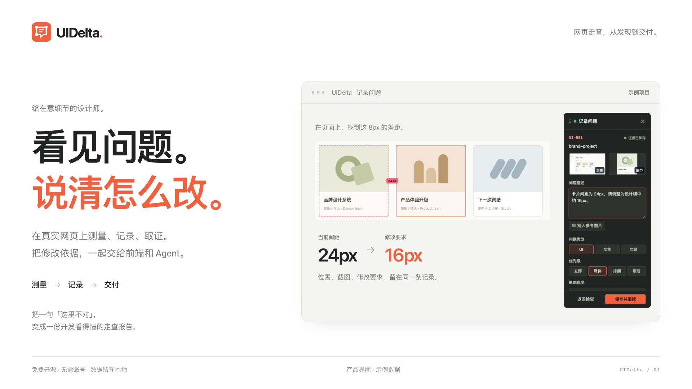
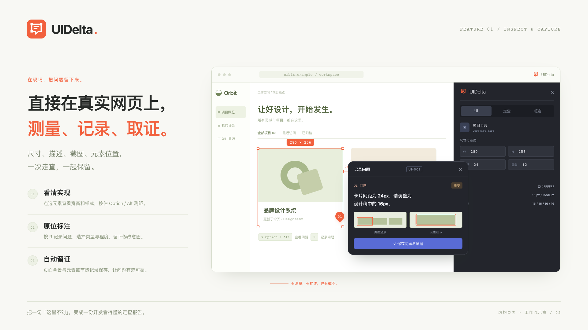
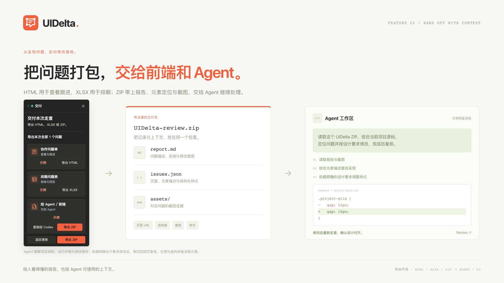
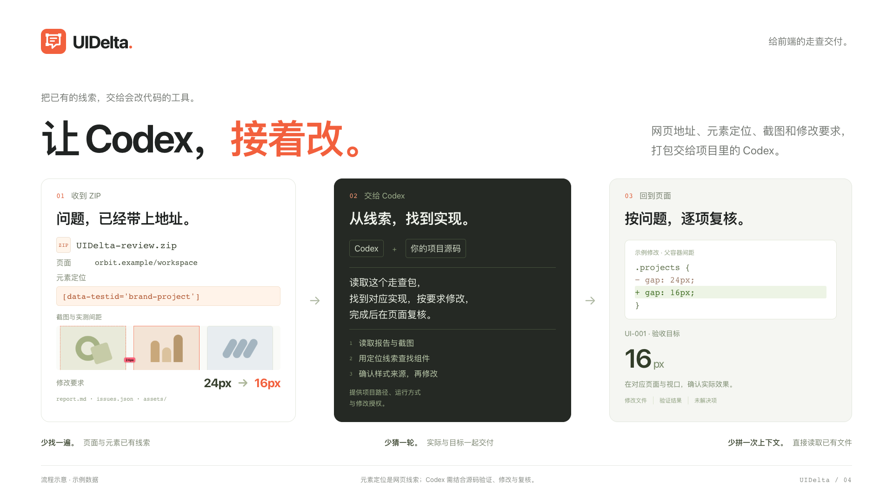

<h1 align="center">UIDelta</h1>
<p align="center"><strong>看见问题。说清怎么改。</strong></p>
<p align="center"><a href="README.en.md">English</a> · <a href="https://tu-dot.github.io/UIDelta/">产品官网</a> · <a href="https://tu-dot.github.io/UIDelta/downloads/UIDelta-v0.9.4.zip">免费下载</a> · <a href="LICENSE">MIT 开源</a></p>



把一句「这里不对」，变成一份开发看得懂的走查报告。

**UIDelta 是一个开源网页走查工具。** 在真实网页上测量、记录、取证，把修改依据一起交给前端和 Agent。

## 三步，把问题说清。

1. **差多少，直接量。** 点选元素查看尺寸、间距与样式。在页面上试改，确认修改方向。
2. **问题在哪，证据就在哪。** 写下修改要求。页面全景、元素细节和位置，跟着记录一起保存。
3. **记录一次，接着改。** 导出报告给团队，或把 ZIP 交给前端和 Agent。交接时少一次追问。



## 谁来接手，就选谁用得上的格式。

| 格式 | 用来做什么 |
| --- | --- |
| **HTML · 协作问题单** | 打开，就看懂。把问题和截图放在一起，方便查看、跟进。 |
| **XLSX · 排期问题表** | 排好，逐项改。把问题带进表格，安排优先级与修复排期。 |
| **ZIP · 给前端 / Agent** | 报告、元素定位与截图打包交付，结合项目源码继续处理。 |



<a id="for-developers"></a>

## 给前端：让 Codex，接着改。

**拿到走查 ZIP，把它放进项目，交给 Codex 继续处理。** 页面地址、元素定位、截图和修改要求已经跟着问题打包，前端可以少做一轮重复定位和上下文整理。



- **少找一遍。** URL、DOM 选择器、test id 和元素文本，给 Codex 一个明确的查找起点。
- **少猜一轮。** 实测样式、截图和修改要求放在一起，知道哪里不同、要改成什么。
- **少拼一次上下文。** 让 Codex 读取 `report.md`、`issues.json` 和 `assets/`，在项目中查找对应实现，按问题编号修改并复核。

在 Codex 中打开项目，提供 ZIP 的文件路径；若不能直接读取压缩包，先解压并提供目录路径。然后告诉它：

```text
读取这个 UIDelta 走查包，结合当前项目源码定位问题，
按报告中的明确要求修改。完成后运行相关检查，回到页面复核，
按问题编号列出修改结果、涉及文件和未解决项。
```

元素定位是网页线索，Codex 仍需验证对应源码。请提供项目运行方式与修改授权；修改目标不明确时先补充依据。

这套交付可帮助减少 **6 类重复工作**：找页面、辨认元素、还原记录时的现场、澄清目标、组织 AI 输入、按编号复核。它们是流程分析的分类，暂未测得提效百分比。[查看调研与依据](docs/marketing/DEVELOPER-HANDOFF-RESEARCH.zh-CN.md) · [完整交接说明](docs/AGENT-HANDOFF.md)

## 从下一次走查开始。

当前版本 **v0.9.4 · 开发者预览版**，通过 Chrome 手动加载，尚未上架扩展商店。

1. [下载插件 ZIP](https://tu-dot.github.io/UIDelta/downloads/UIDelta-v0.9.4.zip)，解压。
2. 打开 `chrome://extensions`，开启「开发者模式」。点击「加载已解压的扩展程序」，选择包含 `manifest.json` 的 **UIDelta** 文件夹。
3. 固定插件并刷新目标网页。点击 UIDelta 图标，或按 **Option / Alt + Shift + I** 开始。

使用源码时，直接加载仓库内的 **extension** 文件夹。详细步骤见 [安装指南](docs/INSTALL.md)。

**无需账号，无需 API Key。** 当前版本的走查记录与截图保存在浏览器本地，不向外部服务器发送。查看 [隐私与权限说明](PRIVACY.md)。

<details>
<summary>快捷键与进阶功能</summary>

| 操作 | 快捷键 |
| --- | --- |
| 开关 UIDelta | Option / Alt + Shift + I |
| 查看元素间距 | 按住 Option / Alt |
| 穿透选择元素 | 按住 Command / Ctrl |
| 记录问题 | R |
| 打开问题列表 | I |
| 临时操作原网页 | 按住 Space |
| 保存问题 | Command / Ctrl + Enter |
| 关闭当前面板 | Esc |

还支持本地样式试改与撤销、区域记录、问题检索与筛选，以及手动导入 Figma Frame JSON 快照进行设计对比。参阅 [设计对比说明](docs/DESIGN-COMPARE.md)。

</details>

<details>
<summary>当前使用边界</summary>

- 页面试改只影响当前预览，刷新后恢复；UIDelta 不修改网站源码。
- ZIP 提供元素锚点，不提供已经验证的源码文件与行号，也不包含自动修复程序。
- AI 自动走查、在线 Figma 同步和项目管理平台直连仍在规划中。
- Chrome 内部页面、扩展商店等受保护页面无法注入。
- 跨域 iframe、封闭 Shadow DOM、伪元素与 Canvas 内部对象不能独立选择。
- 本地 `file://` 页面需开启「允许访问文件网址」。
- 宣传素材使用真实插件界面与示例数据；截图来源记录在 [SOURCE.json](brand/screenshots/SOURCE.json)。测试页使用模拟桥接，真实截图、存储和下载需按 [QA 说明](docs/QA.md) 在浏览器中验证。

</details>

## 一起把细节做好。

需要 Node.js 22+，项目没有 npm 依赖。

```sh
git clone https://github.com/tu-dot/UIDelta.git
cd UIDelta
npm run check
npm test
npm run build
npm start
```

本地官网：`http://127.0.0.1:4173/`。ZIP 输出至 `release/`，可部署网页输出至 `_site/`。

[提交问题](https://github.com/tu-dot/UIDelta/issues) · [贡献指南](CONTRIBUTING.md) · [路线图](ROADMAP.md) · [宣传材料与文案](docs/marketing/README.md)

作者：[土墩](https://github.com/tu-dot) · [MIT License](LICENSE)
