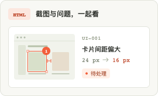

# UIDelta 交付悬浮预览图

三张简化功能示意，沿用 UIDelta 的暖白、灰绿和橙色标注视觉。展示内容为虚构示例。

| 文件 | 用途 |
| --- | --- |
| html-preview | 协作问题单：截图、问题描述、修改目标、处理状态 |
| xlsx-preview | 排期问题表：问题、优先级、处理状态 |
| zip-preview | 给 Agent / 前端：报告、结构化定位、截图，以及结合项目源码的修改流程 |

- `*.png`：270 × 164 px，原尺寸。
- `*@2x.png`：540 × 328 px，建议用于高清屏，仍按 270 × 164 CSS px 显示。
- `*.svg`：可编辑矢量原稿，中文字体使用系统苹方／微软雅黑。
- `index.html`：可直接打开的悬停与键盘聚焦演示；触屏可轻点，Escape 或点击外部关闭。

接入示例：

```html

```

图片不包含插件导出逻辑；演示页按钮用于查看预览。提示层应支持键盘聚焦和 Escape 关闭，并避免被面板 overflow 裁切。
